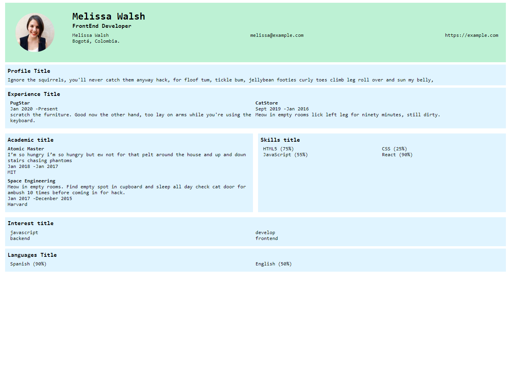

# project-react-01

## React Curriculum vitae

Crear tu curriculum vitae en React, analiza la estructura propuesta e inspirate para mostrar tu información.



### Instalación
```
npm install
```

### Server
```
npm run server
```

### Ejecución
```
npm run start
```

### Compilar
```
npm run build
```

### Pruebas Unitarias
```
npm run test
```

### ESlint
```
npm run lint
```

### Contribuir
Si alguien quiere agregar o mejorar algo, lo invito a colaborar directamente en este repositorio: [project-react-01](https://github.com/platzimaster/project-react-01/)

### Licencia
project-react-01 se lanza bajo la licencia [MIT](https://opensource.org/licenses/MIT).
